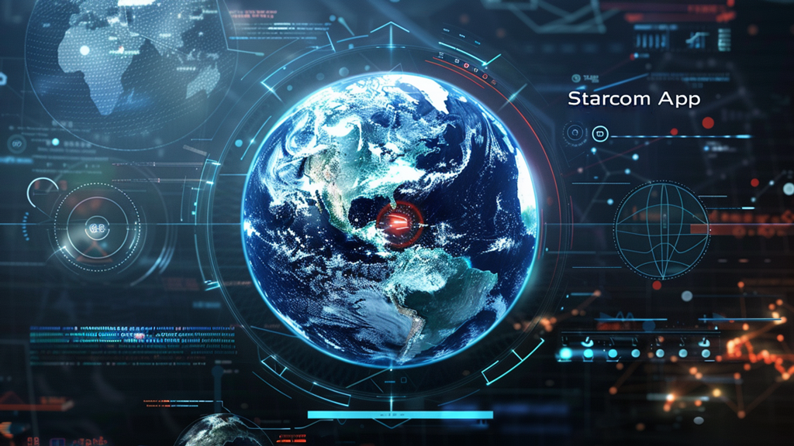
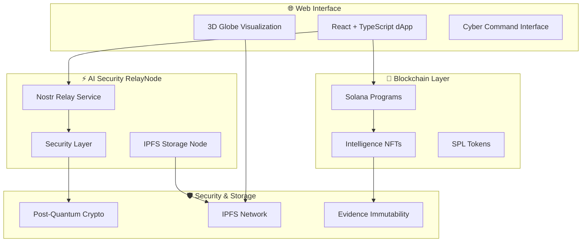

# ⭐ STARCOM: Earth Alliance Star Command Platform 🌍

<div align="center">



---

*[View Complete Architecture Diagram](./docs/architecture/ARCHITECTURE-DIAGRAM.md)*

**The Earth Alliance's Decentralized Intelligence Exchange Platform**  
*Empowering Global Citizens with Professional Intelligence Tools*

*A quantum-safe, decentralized intelligence marketplace with 3D cyber command interface*

[](https://opensource.org/licenses/MIT)
[](https://www.typescriptlang.org/)
[](https://reactjs.org/)
[](https://solana.com/)
[](https://www.rust-lang.org/)

📚 **[Complete Documentation](./docs/README.md)** | 📊 **[Project Overview](./docs/PROJECT-OVERVIEW.md)** | 🏗️ **[Architecture](./docs/architecture/ARCHITECTURE-DIAGRAM.md)**

</div>

---

## 📋 Table of Contents

- [🎯 Mission](#-mission)
- [🚀 Quick Start](#-quick-start)
- [🏗️ Architecture](#️-architecture)
- [✨ Key Features](#-key-features)
- [🏢 Project Structure](#-project-structure)
- [🔐 Security Model](#-security-model)
- [💡 Use Cases](#-use-cases)
- [🛠️ Development](#️-development)
- [📊 Market Opportunity](#-market-opportunity)
- [🤝 Contributing](#-contributing)
- [📚 Documentation](#-documentation)

---

## 🎯 Mission

**STARCOM** (Star Command) is the Earth Alliance's revolutionary decentralized intelligence exchange platform, empowering civilian-led intelligence operations through a sophisticated 3D cyber command interface, blockchain-powered intelligence trading, and quantum-safe communications.

### 🌍 Earth Alliance Star Command Platform
A Global Citizen accessible intelligence gathering media platform designed for civilian-led intelligence operations in conjunction with the Earth Alliance, featuring:
- **Intelligence Markets**: Trade and verify intelligence reports using blockchain technology
- **3D Globe Cyber Command Interface**: Immersive global visualization for cyber investigations
- **Open Source Intelligence (OSINT)**: Civilian-accessible intelligence gathering and analysis
- **Global Citizen Platform**: Democratized intelligence operations supporting Earth Alliance missions
- **Quantum-Safe Security**: Post-quantum cryptography protecting against future threats  
- **Censorship-Resistant**: Decentralized architecture with no single points of failure
- **Real-Time Coordination**: Team-based communication via Nostr protocol for global operations

---

## 🌍 Earth Alliance Star Command

### Mission Statement
Star Command serves as the Earth Alliance's premier platform for **civilian-led intelligence operations**, democratizing access to professional-grade intelligence tools and creating a global network of citizen investigators working toward truth and transparency.

### Core Principles
- **Civilian Empowerment**: Professional intelligence tools accessible to global citizens
- **Earth Alliance Support**: Direct integration with Earth Alliance operational objectives
- **Decentralized Operations**: No central authority controlling intelligence flow
- **Truth & Transparency**: Open verification of intelligence through blockchain immutability
- **Global Coordination**: Worldwide network of civilian intelligence operators

### Operational Framework
- **🔍 Cyber Investigations**: Advanced digital forensics tools for civilian investigators  
- **🌐 OSINT Collection**: Systematic Open Source Intelligence gathering and analysis
- **🤝 Collaborative Networks**: Team-based intelligence operations across global citizen networks
- **📊 Intelligence Markets**: Economic incentives for quality intelligence contributions
- **🛡️ Secure Communications**: Quantum-safe, censorship-resistant operational communications

---

## 🚀 Quick Start

### Web Application (dapp)
```bash
cd dapp
npm install
npm run dev
# Access: http://localhost:5174
```

### AI Security RelayNode  
```bash
cd ai-security-relaynode
cargo build --release
cargo run
# Provides local Nostr relay + IPFS node
```

### For AI Agents
1. Read `.onboarding` for immediate context
2. Review `docs/EARTH-ALLIANCE-MISSION-ANALYSIS.md` for mission context
3. Check `.primer` for development conventions

---

## 🏗️ Architecture

<div align="center">



</div>

### 🔧 Core Technologies

| Layer | Technology | Purpose |
|-------|------------|---------|
| **Frontend** | React + TypeScript + Vite | Modern web interface |
| **3D Engine** | Three.js + WebGL | Interactive global visualization |
| **Blockchain** | Solana + Anchor Framework | High-performance smart contracts |
| **Communications** | Nostr Protocol | Censorship-resistant messaging |
| **Storage** | IPFS + Arweave | Decentralized data persistence |
| **Security** | Post-Quantum Cryptography | Future-proof encryption |
| **Infrastructure** | Rust + Tauri | High-performance native services |

---

## ✨ Key Features

### 🏪 Intelligence Exchange Marketplace
- **NFT Intelligence Reports**: Tokenized intelligence assets on Solana blockchain
- **Civilian-Led Operations**: Empowering citizen intelligence gathering and verification
- **Decentralized Trading**: P2P marketplace with escrow and verification systems
- **Quality Incentives**: Economic rewards for accurate intelligence contributions
- **Multi-Agency Coordination**: Secure collaboration between Earth Alliance operations
- **Global Access**: Democratized intelligence marketplace for worldwide participation

### 🌍 3D Globe Cyber Command Interface
- **Interactive Earth Visualization**: Real-time 3D globe with intelligence data overlays
- **Cyber Investigation Tools**: Advanced geospatial analysis for digital forensics
- **OSINT Integration**: Open Source Intelligence collection and visualization
- **Global Citizen Access**: Democratized intelligence tools for civilian operations
- **Real-Time Data Feeds**: Live integration with NOAA, financial markets, and public data sources
- **Immersive Command Center**: Professional-grade cyber operations interface

### 🛡️ Advanced Security
- **Quantum-Safe Cryptography**: ML-KEM + ML-DSA algorithms
- **Zero-Knowledge Proofs**: Privacy-preserving authentication
- **Multi-Signature Escrow**: Secure intelligence transactions
- **Decentralized Identity**: Self-sovereign authentication

### ⚡ Real-Time Communications
- **Nostr Protocol**: Decentralized, censorship-resistant messaging for Earth Alliance operations
- **Civilian Team Channels**: Secure group communications with hierarchical access controls
- **Cross-Operation Coordination**: Inter-team collaboration protocols for global missions
- **Bridge Discovery**: Automated connection to Earth Alliance communication networks
- **Offline Capability**: Local network operations for field intelligence gathering

---

## 🏢 Project Structure

```
starcom-app/
├── dapp/                          # React/TypeScript Web Interface
│   ├── src/
│   │   ├── components/           # UI components & layouts
│   │   ├── services/            # Blockchain & IPFS services
│   │   ├── globe-engine/        # 3D visualization engine
│   │   ├── contracts/           # Solana program interfaces
│   │   └── types/               # TypeScript definitions
│   ├── public/                  # Static assets
│   └── docs/                    # Architecture & API docs
│
├── ai-security-relaynode/        # Rust/Tauri Native Services
│   ├── src/
│   │   ├── nostr_relay.rs      # Nostr protocol implementation
│   │   ├── ipfs_node.rs        # IPFS storage service
│   │   ├── security_layer.rs   # Post-quantum cryptography
│   │   └── api_gateway.rs      # HTTP API for dApp integration
│   └── tauri.conf.json         # Desktop app configuration
│
└── asset development/            # Design assets & graphics
```

---

## 🔐 Security Model

### Post-Quantum Cryptography
```rust
// Example: Quantum-safe encryption
use pqcrypto_kyber::kyber1024;
use pqcrypto_dilithium::dilithium5;

// Key encapsulation
let (pk, sk) = kyber1024::keypair();
let (ss, ct) = kyber1024::encapsulate(&pk);

// Digital signatures  
let (pk, sk) = dilithium5::keypair();
let sig = dilithium5::sign(message, &sk);
```

### Decentralized Architecture
- **No Central Servers**: Serverless deployment with fallback relays
- **Mesh Networking**: Teams run their own infrastructure nodes
- **Censorship Resistance**: Multiple communication pathways
- **Data Sovereignty**: Teams control their own intelligence data

---

## 💡 Use Cases

### 🌍 Global Citizens & Civilian Intelligence
- **Citizen Intelligence Operations**: Empower civilian-led investigations and OSINT collection
- **Multi-Source Intelligence**: Combine SIGINT, HUMINT, OSINT, CYBERINT for comprehensive analysis
- **Collaborative Analysis**: Real-time team-based intelligence workflow for Earth Alliance missions
- **Intelligence Asset Trading**: Monetize and acquire verified intelligence through decentralized marketplace
- **Global Coordination**: Secure communications across civilian intelligence networks worldwide

### 🏢 Enterprise Security
- **Threat Intelligence**: Access verified threat data from marketplace
- **Security Coordination**: Team-based incident response and analysis
- **Evidence Management**: Immutable storage for security investigations
- **Compliance Reporting**: Auditable intelligence workflows

### 🌐 Research & OSINT Community
- **Open Source Intelligence**: Collaborative OSINT collection and analysis platform
- **Civilian Researchers**: Democratized access to professional intelligence tools
- **Data Verification**: Multi-source confirmation of research findings through blockchain
- **Academic Collaboration**: Secure research data sharing for Earth Alliance objectives
- **Knowledge Markets**: Incentivize quality research contributions from global citizens

---

## 🛠️ Development

### Prerequisites
```bash
# Node.js 18+ for dApp
node --version

# Rust 1.70+ for RelayNode
rustc --version

# Solana CLI for blockchain development
solana --version
```

### Build & Test
```bash
# Web Application
cd dapp
npm install
npm run build
npm run test:safe

# AI Security RelayNode
cd ai-security-relaynode  
cargo build --release
cargo test
```

### Development Environment
```bash
# Start development servers
npm run dev          # Web interface on :5174
cargo run           # RelayNode services on :8080/:8081
solana test-validator # Local Solana blockchain
```

---

## 📊 Market Opportunity & Earth Alliance Impact

| Market Segment | Size | Star Command Use Case |
|----------------|------|----------------------|
| **Civilian Intelligence** | $75B+ | Empowering global citizens with professional intelligence tools |
| **OSINT & Research** | $50B+ | Democratized Open Source Intelligence platform |
| **Cybersecurity** | $150B+ | Civilian-accessible threat intelligence and cyber investigation tools |
| **Defense Intelligence** | $100B+ | Supporting Earth Alliance operations through civilian networks |
| **Financial Intelligence** | $50B+ | AML, fraud detection, compliance through decentralized verification |
| **Enterprise Security** | $200B+ | Corporate security enhanced by civilian intelligence networks |

### Earth Alliance Strategic Impact
- **Global Citizen Empowerment**: Democratizing intelligence capabilities previously limited to government agencies
- **Decentralized Truth Networks**: Creating censorship-resistant intelligence verification systems
- **Civilian-Led Operations**: Supporting Earth Alliance missions through distributed global networks
- **Transparency Revolution**: Blockchain-verified intelligence challenging traditional information gatekeepers
- **Economic Incentives**: Creating sustainable markets for civilian intelligence contributions

### Competitive Advantages
- **First-Mover**: World's first blockchain-powered civilian intelligence marketplace
- **Earth Alliance Integration**: Direct support for global truth and transparency operations
- **Quantum-Safe**: Future-proof security implementation protecting civilian operations
- **Decentralized**: No single point of failure or censorship for global intelligence networks
- **Immersive UX**: Professional 3D cyber command interface accessible to civilian operators
- **Open Architecture**: Extensible platform supporting diverse Earth Alliance mission requirements

---

## 🤝 Contributing

### Development Priorities
1. **Civilian Accessibility**: Ensure all features remain accessible to non-technical global citizens
2. **Earth Alliance Mission**: All development must support truth, transparency, and global coordination
3. **Security First**: Maintain quantum-safe, zero-trust architecture protecting civilian operations
4. **Decentralization**: Eliminate any single points of failure or censorship
5. **User Experience**: Maintain intuitive cyber command interface for civilian operators
6. **Open Standards**: Use open protocols (Nostr, IPFS, Web3) supporting global accessibility

### Getting Started
1. Fork the repository
2. Read `.onboarding` and `.primer` for project context
3. Check `docs/BUILD-STATUS.md` for current development status
4. Submit PRs with comprehensive tests and documentation

---

## 📜 License

This project is licensed under the MIT License - see the [LICENSE](LICENSE) file for details.

---

## 🌟 Vision

*"Empowering Global Citizens with professional-grade intelligence tools to support Earth Alliance operations through decentralized, quantum-safe technology that champions truth, transparency, and worldwide coordination."*

**Star Command: Where civilian intelligence operations meet advanced decentralized technology, creating the impossible infrastructure for a transparent, globally coordinated intelligence network.**

---

## 📚 Documentation

For comprehensive documentation, please visit our organized docs structure:

- **📊 [Project Overview](./docs/PROJECT-OVERVIEW.md)** - Complete project status and architecture overview
- **🏗️ [Architecture](./docs/architecture/ARCHITECTURE-DIAGRAM.md)** - System architecture and design
- **🚀 [Deployment](./docs/deployment/)** - Deployment guides and procedures
- **🎨 [UI/UX Design](./docs/ui-ux/)** - User interface and experience documentation
- **👥 [Team Collaboration](./docs/team-collaboration/)** - Team workflow and collaboration guides
- **🌐 [dApp Documentation](./docs/dapp/)** - Frontend application documentation
- **🤖 [AI Security RelayNode](./docs/ai-security-relaynode/)** - Backend security node documentation
- **📋 [Project Management](./docs/project-management/)** - Project status and completion reports

📚 **[Full Documentation Index](./docs/README.md)**

---

<div align="center">

**🌍 Earth Alliance Star Command • Global Citizen Intelligence Platform 🌍**

*Quantum-Safe • Censorship-Resistant • Civilian-Accessible • Future-Proof*

*Democratizing Intelligence Operations for Truth & Transparency*

[Documentation](./docs/README.md) • [Architecture](./docs/architecture/ARCHITECTURE-DIAGRAM.md) • [Project Overview](./docs/PROJECT-OVERVIEW.md)

</div>
