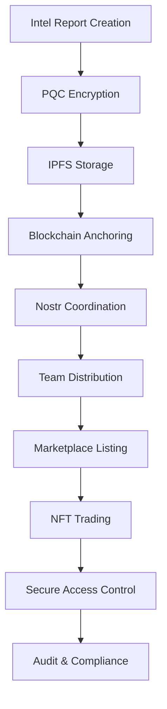

# Intelligence Ecosystem - Unified Architecture Refactor Plan

**Date:** June 25, 2025 (UPDATED)  
**Project:** Starcom Intelligence Market Exchange  
**Phase:** AI Security RelayNode Implementation  
**Architecture:** User-Installable Unified Relay & Storage Node  

---

## 🚀 BREAKTHROUGH UPDATE: AI Security RelayNode Strategy

**MAJOR ARCHITECTURAL PIVOT** - We are discarding all previous complex multi-tier relay strategies in favor of a clean, focused solution: the **AI Security RelayNode**.

### **New Strategic Direction**
- **Single Application**: User-downloadable desktop app combining Nostr relay + IPFS node
- **Unified Services**: Both real-time communication and decentralized storage in one package
- **Team Independence**: Teams run their own infrastructure with zero external dependencies
- **Real-Time Performance**: Perfect WebSocket experience without compromise
- **Plug-and-Play**: Auto-discovery and integration with Starcom dApp

### **Architecture Document**: 
📋 **[AI-SECURITY-RELAYNODE-ARCHITECTURE.md](./AI-SECURITY-RELAYNODE-ARCHITECTURE.md)** - Complete specification

### **Deprecated Documents**:
- ❌ `REAL-TIME-WEBSOCKET-RELAY-NODE-STRATEGY.md` (Multi-tier approach discarded)
- ❌ `RUST-WASM-EMBEDDED-RELAY-ANALYSIS.md` (Browser constraints invalidated approach)
- ⚠️ `TAURI-RELAY-NODE-IMPLEMENTATION.md` (Partial - will be superseded by unified spec)

---

## 🎯 Executive Summary

Based on comprehensive codebase analysis, the Intelligence Market Exchange platform requires a **unified architectural refactor** to consolidate fragmented implementations of Intel, Intel Reports, Intelligence Exchange Marketplace, PQC, Cyber Investigations, Team Communication, Nostr Relays, and IPFS Nodes into a cohesive, production-ready system.

**NEW FOUNDATION**: All real-time communication and decentralized storage will be built on the AI Security RelayNode architecture, providing teams with their own infrastructure while maintaining the serverless dApp benefits.

### **Current State Analysis**
- ✅ **Strong MVP Foundation**: Cyber Investigation components are functional and integrated
- ✅ **Excellent Documentation**: Comprehensive architectural planning and analysis
- ✅ **Advanced Security Design**: Post-quantum cryptography framework designed
- ✅ **Clear Path Forward**: AI Security RelayNode provides unified solution
- ❌ **Fragmented Implementation**: Multiple overlapping, incomplete implementations
- ❌ **Protocol Gaps**: Mock/demo implementations instead of real protocols
- ❌ **Integration Blockers**: Components not properly interconnected

### **Refactor Objectives**
1. **Implement AI Security RelayNode** → User-installable Nostr+IPFS combined service
2. **Unify Intelligence Architecture** → Single coherent system from fragmented components
3. **Implement Real Protocols** → Replace mocks with production Nostr, IPFS, PQC
4. **Integrate All Systems** → Seamless data flow between marketplace, cyber ops, and communications
5. **Enable Production Deployment** → Fully functional, SOCOM-compliant platform

---

## 🔍 Architectural State Analysis

### **Intelligence & Reporting Systems**

| Component | Status | Issues | Required Action |
|-----------|---------|---------|-----------------|
| `CyberInvestigationMVP.tsx` | ✅ **Complete** | None | Maintain as reference implementation |
| `IntelReportSubmission.tsx` | ✅ **Complete** | Uses Solana wallet, needs real services | Connect to production Nostr/IPFS |
| `IntelReportViewer.tsx` | ✅ **Complete** | None | Enhance with marketplace integration |
| `IntelReportService.ts` | 🟡 **Partial** | Basic functionality only | Enhance with PQC & blockchain |
| `intelligence.ts` API | 🟡 **Partial** | Mock data, limited integration | Replace with unified service |
| `IntelPackageManager.tsx` | ✅ **Complete** | Advanced features, uses Solana | Integrate with marketplace |
| `CyberTeamManager.tsx` | ✅ **Complete** | Advanced security features | Integrate with Nostr comms |
| `InvestigationBoard.tsx` | ✅ **Complete** | Kanban workflow, IPFS uploads | Connect to real IPFS |

### **🆕 Web3 & Authentication Infrastructure (FUNCTIONAL)**

| Component | Status | Issues | Required Action |
|-----------|---------|---------|-----------------|
| `AuthContext.tsx` | ✅ **Complete** | Advanced PQC auth, DID support | Cross-connect with team communication |
| `Web3LoginPanel.tsx` | ✅ **Complete** | Full wallet integration | Integrate with intel operations |
| `useSIWS.ts` | ✅ **Complete** | Sign-In with Solana working | Use for team auth in cyber ops |
| `useAuth.ts` | ✅ **Complete** | Cryptographic authentication | Connect to Nostr identity |
| `BlockchainAnchorService.ts` | ✅ **Advanced** | IPFS hash anchoring, retry logic | Integrate with intel reports |
| Solana Wallet Integration | ✅ **Complete** | `@solana/wallet-adapter` working | Use for all team operations |

### **🆕 3D Visualization & Globe Engine (FUNCTIONAL)**

| Component | Status | Issues | Required Action |
|-----------|---------|---------|-----------------|
| `GlobeEngine.ts` | ✅ **Complete** | Full Three.js implementation | Integrate with intel markers |
| `useIntelReport3DMarkers.ts` | ✅ **Complete** | 3D intel visualization | Connect to real intel data |
| `GlobeTextureLoader.ts` | ✅ **Complete** | Advanced texture management | Ready for intel overlays |
| `GlobeMaterialManager.ts` | ✅ **Complete** | Shader management | Enhance for intel classification |
| Three.js Integration | ✅ **Complete** | Full 3D globe with markers | Connect to team operations |

### **🆕 Data Management & Integration (FUNCTIONAL)**

| Component | Status | Issues | Required Action |
|-----------|---------|---------|-----------------|
| `StarcomDataManager.ts` | ✅ **Complete** | Centralized data orchestration | Connect to intel workflows |
| `IntelDataProvider.ts` | ✅ **Complete** | Intel report data layer | Integrate with real-time updates |
| `realTimeEventSystem.ts` | ✅ **Complete** | UI event coordination | Connect to Nostr messaging |
| Data Provider Registry | ✅ **Complete** | Multiple data sources | Add intel marketplace data |

### **Intelligence Exchange Marketplace**

| Component | Status | Issues | Required Action |
|-----------|---------|---------|-----------------|
| `IntelligenceMarketplace.tsx` | 🟡 **UI Only** | No real trading logic | Connect to Solana program |
| `IIntelligenceMarketplace.ts` | ✅ **Well Designed** | Interface only | Implement with existing auth |
| `intel-market/lib.rs` | 🟡 **Partial** | Basic Solana program | Complete marketplace logic |
| `AssetTrading.tsx` | 🟡 **UI Only** | Mock functionality | Use existing wallet integration |
| `CollaborationService.ts` | � **Advanced Mock** | No real Web3 integration | Use existing Solana services |
| `SessionManager.tsx` | 🟡 **UI Complete** | Advanced collaboration UI | Connect to real-time events |

### **🔴 CRITICAL GAPS - Communication Protocols**

| Component | Status | Issues | Required Action |
|-----------|---------|---------|-----------------|
| `nostrService.ts` | 🔴 **Mock Only** | No real WebSocket relays | **Priority #1** - Team comms blocked |
| `TeamCommunication.tsx` | ✅ **UI Complete** | Uses mock service | Connect to real Nostr |
| `CommunicationPanel.tsx` | ✅ **UI Complete** | Advanced styling, mock data | Connect to real Nostr |
| Nostr Protocol Libraries | ✅ **Installed** | `nostr-tools` available | Implement production service |

### **🔴 CRITICAL GAPS - Storage & Security**

| Component | Status | Issues | Required Action |
|-----------|---------|---------|-----------------|
| `SOCOMPQCryptoService.ts` | 🔴 **Mock Only** | Simple XOR operations | **Priority #2** - Security foundation |
| `IPFSService.ts` | 🟡 **Advanced Mock** | Sophisticated interface, no real IPFS | **Priority #3** - Data persistence |
| `backup/legacy-crypto/PQCryptoService.ts` | 🔴 **Legacy** | Outdated implementation | Archive and replace |

---

## 🏗️ Unified Architecture Vision

### **Three-Pillar Integration**

```typescript
// Unified Intelligence Ecosystem Architecture
interface UnifiedIntelligenceEcosystem {
  // PILLAR 1: Intelligence Operations
  intelligenceOps: {
    reporting: CyberInvestigationMVP;           // ✅ Complete
    packageManagement: IntelPackageManager;    // ✅ Complete  
    teamManagement: CyberTeamManager;          // ✅ Complete
    investigationWorkflow: InvestigationBoard; // ✅ Complete
  };
  
  // PILLAR 2: Marketplace & Trading
  marketplace: {
    assetTrading: IntelligenceMarketplace;     // ❌ Needs Web3 integration
    nftMinting: NFTMintingService;             // ❌ Missing implementation
    smartContracts: SolanaProgram;             // 🟡 Partial implementation
    walletIntegration: Web3WalletService;      // ❌ Missing integration
  };
  
  // PILLAR 3: Communication & Storage
  infrastructure: {
    messaging: ProductionNostrService;         // ❌ Critical gap
    storage: ProductionIPFSService;            // ❌ Critical gap
    security: ProductionPQCService;            // ❌ Critical gap
    networking: RelayNetworkManager;           // ❌ Missing component
  };
}
```

### **Data Flow Architecture**



---

## 🚀 Phased Refactor Roadmap

### **Phase 1: Foundation Systems (Week 1-2)**
**Priority: CRITICAL - Replace Mock Services with Production**

#### **1.1 Real Nostr Protocol Implementation**
- **Objective**: Replace mock `nostrService.ts` with production WebSocket relay connections
- **Leverage**: Use existing `nostr-tools` library (already installed)
- **Integration Points**: 
  - `TeamCommunication.tsx` (complete UI, needs real service)
  - `CommunicationPanel.tsx` (advanced styling, needs real messaging)
  - Use existing `useAuth()` DID for Nostr identity
- **Quick Integration**: Connect to existing real-time event system

#### **1.2 Production PQC Implementation**  
- **Objective**: Replace mock crypto with real quantum-safe algorithms
- **Integration**: Use existing advanced `AuthContext` security metadata structure
- **Cross-Connect**: Enhance existing blockchain anchoring with PQC signatures
- **Security Layer**: Add to existing SIWS authentication flow

#### **1.3 Production IPFS Integration**
- **Objective**: Replace mock IPFS with real decentralized storage
- **Leverage**: Use existing `BlockchainAnchorService` for content hash anchoring
- **Integration**: 
  - `InvestigationBoard.tsx` already has IPFS upload UI
  - `IntelPackageManager.tsx` already references IPFS operations
  - Connect to existing 3D globe for visualization

#### **1.4 Cross-System Integration Wins**
- **Auth → Teams**: Use SIWS session for Nostr identity
- **IPFS → Globe**: Intel reports on 3D markers with real storage
- **Blockchain → Marketplace**: Existing anchor service for NFT metadata
- **Events → UI**: Real-time collaboration events to existing event system

### **Phase 2: System Integration (Week 3-4)**
**Priority: HIGH - Leverage Existing Infrastructure**

#### **2.1 Marketplace Integration with Existing Solana**
- **Objective**: Connect marketplace UI to existing Solana program and wallet system
- **Leverage**: 
  - Complete `intel-market/lib.rs` Solana program
  - Working `@solana/wallet-adapter` integration
  - Existing `BlockchainAnchorService` for content integrity
- **Components**: Connect `IntelligenceMarketplace.tsx` to real trading

#### **2.2 Advanced Team Communication**
- **Objective**: Real-time collaboration using existing infrastructure
- **Integration**:
  - `SessionManager.tsx` → Real Nostr channels
  - `realTimeEventSystem.ts` → Nostr event forwarding
  - `AuthContext` DID → Team member verification
- **Cross-Connect**: Use existing 3D globe for team operation visualization

#### **2.3 Data Flow Orchestration**
- **Objective**: Seamless data movement using existing services
- **Components**:
  ```typescript
  // Enhanced UnifiedIntelligenceService using existing infrastructure
  class UnifiedIntelligenceService {
    constructor(
      private dataManager: StarcomDataManager,     // ✅ Already complete
      private auth: AuthContext,                   // ✅ Already complete
      private globe: GlobeEngine,                  // ✅ Already complete
      private events: RealTimeEventSystem,        // ✅ Already complete
      private blockchain: BlockchainAnchorService  // ✅ Already complete
    ) {}
  }
  ```

#### **2.4 Enhanced Security Integration**
- **Objective**: Layer PQC onto existing security infrastructure
- **Enhancements**:
  - Existing `AuthContext` → Add PQC signatures
  - Existing `BlockchainAnchorService` → Quantum-safe transactions
  - Existing team operations → End-to-end encryption

### **Phase 3: Advanced Features (Week 5-6)**
**Priority: MEDIUM - Enhanced Functionality**

#### **3.1 Advanced Security Implementation**
- **Multi-party computation for team decisions**
- **Threshold signatures for high-value operations**  
- **Zero-knowledge proofs for privacy**

#### **3.2 Marketplace Enhancement**
- **Automated NFT minting pipeline**
- **Advanced trading features (auctions, bids)**
- **Revenue sharing and royalty distribution**

#### **3.3 Performance Optimization**
- **Caching layer for frequently accessed data**
- **Connection pooling for Nostr relays**
- **IPFS content delivery optimization**

### **Phase 4: Production Readiness (Week 7-8)**
**Priority: MEDIUM - Deployment & Operations**

#### **4.1 Monitoring & Observability**
- **System health dashboards**
- **Performance metrics collection**
- **Error tracking and alerting**

#### **4.2 Testing & Quality Assurance**
- **End-to-end integration tests**
- **Security penetration testing** 
- **Load testing for production scale**

#### **4.3 Documentation & Training**
- **Operator manuals and procedures**
- **API documentation for developers**
- **Security compliance documentation**

---

## 🛡️ Security Integration Strategy

### **Quantum-Safe Implementation**
```typescript
// Unified security layer across all components
interface UnifiedSecurityLayer {
  // All communications encrypted with ML-KEM-768
  messaging: {
    nostrEvents: 'PQC encrypted before relay transmission';
    teamChats: 'End-to-end quantum-safe encryption';
    marketplaceComms: 'Buyer-seller secure channels';
  };
  
  // All storage protected with quantum-safe algorithms
  storage: {
    ipfsContent: 'Encrypted before IPFS upload';
    blockchainData: 'Quantum-safe transaction signing';
    localCache: 'Client-side encryption at rest';
  };
  
  // All authentication quantum-resistant
  identity: {
    walletAuth: 'PQC-enhanced Web3 authentication';
    teamMembership: 'Quantum-safe identity verification';
    clearanceLevels: 'Cryptographic clearance proofs';
  };
}
```

### **Compliance Framework**
```typescript
interface ComplianceFramework {
  standards: ['NIST-CSF-2.0', 'STIG', 'CNSA-2.0', 'SOCOM-CYBER'];
  auditTrail: 'Immutable audit logs for all operations';
  accessControl: 'Clearance-based authorization system';
  dataClassification: 'Automated classification enforcement';
  incidentResponse: 'Automated security incident handling';
}
```

---

## 🎯 Implementation Priorities

### **🚀 IMMEDIATE WINS - Leverage Existing Functional Systems**
1. **Cross-Connect Auth System**: Web3 login already works - integrate with team communication
2. **Utilize 3D Visualization**: Globe engine is complete - connect intel markers to real data
3. **Integrate Data Management**: StarcomDataManager ready - connect to intel workflows
4. **Leverage Real-Time Events**: Event system functional - connect to Nostr messaging

### **🔴 CRITICAL PATH (Must Complete for Production)**
1. **Nostr Protocol**: Real WebSocket relay connections - **BLOCKING ALL TEAM COMMUNICATION**
2. **PQC Implementation**: Production quantum-safe cryptography - **SECURITY FOUNDATION** 
3. **IPFS Integration**: Real decentralized storage - **DATA PERSISTENCE**
4. **Service Unification**: Coordinated system operations - **SYSTEM COHERENCE**

### **🟡 HIGH PRIORITY (Required for Full Functionality)**
1. **Marketplace Web3 Integration**: Connect UI to existing Solana program
2. **Cross-System Authentication**: Use SIWS for team identity in Nostr
3. **Performance Optimization**: Production-scale performance
4. **Advanced Team Features**: Multi-agency collaboration

### **🟢 MEDIUM PRIORITY (Enhanced Features)**
1. **Advanced Security**: Multi-party computation, threshold signatures
2. **Monitoring & Analytics**: Operational visibility
3. **Advanced UI/UX**: Enhanced user experience
4. **3D Visualization Enhancements**: Advanced intel overlays

---

## 🔄 Updated Integration Strategy

### **Phase 0: Quick Wins (Week 0 - Immediate)**
**Leverage Existing Functional Systems**

#### **0.1 Cross-Connect Authentication to Team Operations**
```typescript
// Connect existing SIWS authentication to team communication
// src/components/CyberInvestigation/TeamCommunication.tsx

// CURRENT: Uses mock auth
const { connected, publicKey } = useWallet();

// ENHANCED: Use full auth context with DID
const { isAuthenticated, session, didAuthState, securityMetadata } = useAuth();

// Use existing DID for Nostr identity
const nostrIdentity = {
  did: didAuthState.did,
  publicKey: session?.publicKey,
  clearanceLevel: securityMetadata.classificationLevel
};
```

#### **0.2 Connect 3D Globe to Real Intel Data**
```typescript
// src/hooks/useIntelReport3DMarkers.ts
// CURRENT: Uses mock intel data
// ENHANCED: Connect to existing IntelReportService

import { IntelReportService } from '../services/IntelReportService';

const intelService = new IntelReportService();
const reports = await intelService.fetchIntelReports();

// Transform to 3D markers using existing transformation logic
const markers = reports.map(transformReportTo3DMarker);
```

#### **0.3 Integrate Real-Time Events with Data Management**
```typescript
// Connect existing realTimeEventSystem to StarcomDataManager
// src/services/UnifiedIntelligenceService.ts

const dataManager = new StarcomDataManager();
const eventSystem = RealTimeEventSystem.getInstance();

// Forward data events to UI
dataManager.setGlobalObserver({
  onFetchStart: (key, sourceId) => {
    eventSystem.emit({
      type: 'UI_SHOW_NOTIFICATION',
      payload: { message: `Loading ${key} from ${sourceId}` },
      source: 'system',
      timestamp: new Date(),
      priority: 'low'
    });
  }
});
```

---

## 🏆 Success Criteria

### **Phase 1 Success (Foundation)**
- ✅ Real Nostr messages sent and received across multiple clients
- ✅ PQC encryption/decryption with production algorithms
- ✅ IPFS content upload/download with verification
- ✅ All MVP components using production services

### **Phase 2 Success (Integration)**
- ✅ End-to-end intel report workflow (creation → storage → team notification → marketplace)
- ✅ Cross-system data consistency and integrity
- ✅ Seamless user experience across all features

### **Phase 3+ Success (Production)**
- ✅ 99.9% uptime and reliability
- ✅ Security compliance verification  
- ✅ Performance targets met (sub-second response times)
- ✅ Full operational documentation

---

## 📋 Next Steps

### **Immediate Actions (This Week)**
1. **Review and approve this refactor plan**
2. **Set up development environment for real protocol implementations**
3. **Begin Nostr protocol implementation (highest priority)**
4. **Research and select PQC libraries for WASM integration**

### **Week 1 Deliverables**
1. **Working Nostr service with real relay connections**
2. **Basic PQC service with real encryption algorithms** 
3. **IPFS service proof-of-concept with content verification**
4. **Updated MVP components using new services**

### **Ongoing Throughout Refactor**
1. **Maintain existing MVP functionality during transition**
2. **Comprehensive testing at each phase**
3. **Security review of all implementations**
4. **Documentation updates reflecting new architecture**

---

## 🔄 Migration Strategy

### **Safe Transition Approach**
1. **Parallel Implementation**: Build new services alongside existing ones
2. **Feature Flags**: Toggle between mock and production services
3. **Gradual Rollout**: Migrate one component at a time
4. **Fallback Mechanisms**: Ability to revert if issues arise
5. **Continuous Testing**: Validate functionality at each step

### **Risk Mitigation**
1. **Backup Current Implementation**: Full system backup before changes
2. **Staged Deployment**: Development → Testing → Production
3. **Monitoring**: Real-time system health monitoring during transition
4. **Rollback Plan**: Documented procedures for reverting changes

---

*This unified refactor plan transforms the fragmented Intelligence Market Exchange into a cohesive, production-ready, quantum-safe platform that fulfills the original architectural vision while maintaining the successful MVP foundation.*
