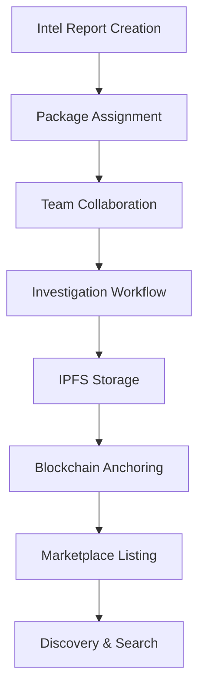

# Collaborative Intelligence System - UI/UX Analysis & Implementation Plan

**Date**: June 24, 2025  
**Status**: ✅ **ANALYSIS COMPLETE - READY FOR IMPLEMENTATION**

---

## 🎯 **Executive Summary**

Following the successful implementation of Intel Report 3D Visualization, this document analyzes the current state of collaborative intelligence workflows and provides a comprehensive UI/UX implementation plan for Teams, Investigations, Intel Packages, IPFS integration, and wallet-based authorship systems.

---

## 📊 **Current System Analysis**

### **✅ Already Implemented Foundation**

#### **3D Intel Report Visualization** (Complete)
- ✅ GLB model rendering at lat/lng coordinates
- ✅ Real-time data fetching and visualization
- ✅ Animation and hover effects
- ✅ Blockchain integration for Intel Report creation

#### **Collaboration Infrastructure** (Partially Complete)
- ✅ Comprehensive type system (`src/types/features/collaboration.ts`)
- ✅ Session management architecture
- ✅ Real-time communication interfaces
- ✅ Multi-agency support (SOCOM, Space Force, Cyber Command)
- ✅ Classification level handling
- ✅ Basic UI components in `src/components/Collaboration/`

#### **Blockchain & Storage Architecture** (Foundation Ready)
- ✅ Solana integration for Intel Reports
- ✅ Wallet-based authentication system
- ✅ IPFS/Arweave storage planning in documentation
- ✅ NFT metadata standards for intelligence assets

#### **UI Foundation** (Ready for Enhancement)
- ✅ HUD Layout system with popup management
- ✅ RightSideBar Intel Report creation
- ✅ Authentication gates and wallet integration
- ✅ Notification system and real-time events

---

## 🚀 **Implementation Roadmap**

### **Phase 1: Intel Packages & Grouping UI (Week 1)**

#### **1.1 Intel Package Management System**

**New Components:**
```typescript
// src/components/Intel/IntelPackageManager.tsx
interface IntelPackage {
  id: string;
  name: string;
  description: string;
  createdBy: string;
  createdAt: Date;
  reports: string[]; // Array of Intel Report IDs
  tags: string[];
  classification: ClearanceLevel;
  collaborators: string[];
  status: 'ACTIVE' | 'ARCHIVED' | 'SHARED';
  ipfsHash?: string;
}
```

**UI Features:**
- **Package Creation Modal**: Create new Intel Packages with metadata
- **Report Assignment**: Drag-and-drop Intel Reports into packages
- **Package Gallery**: Visual grid of packages with thumbnails
- **Search & Filter**: By tags, collaborators, classification
- **Export Options**: IPFS upload, blockchain anchoring

#### **1.2 Team Management Interface**

**New Components:**
```typescript
// src/components/Collaboration/TeamManager.tsx
interface Team {
  id: string;
  name: string;
  agency: AgencyType;
  members: Operator[];
  clearanceLevel: ClearanceLevel;
  specializations: string[];
  activeInvestigations: string[];
  createdAt: Date;
}
```

**UI Features:**
- **Team Creation Wizard**: Multi-step team setup
- **Member Invitation**: Wallet-based invite system
- **Role Assignment**: Lead Analyst, Support Analyst, Observer
- **Permission Matrix**: Granular access control visualization
- **Team Dashboard**: Activity feed, shared resources

#### **1.3 Investigation Workflow System**

**New Components:**
```typescript
// src/components/Investigation/InvestigationBoard.tsx
interface Investigation {
  id: string;
  title: string;
  description: string;
  leadTeam: string;
  participatingTeams: string[];
  intelPackages: string[];
  timeline: InvestigationEvent[];
  status: 'PLANNING' | 'ACTIVE' | 'ANALYSIS' | 'COMPLETED';
  classification: ClearanceLevel;
}
```

**UI Features:**
- **Investigation Board**: Kanban-style workflow management
- **Timeline View**: Chronological investigation events
- **Resource Allocation**: Assign teams and intel packages
- **Progress Tracking**: Visual progress indicators
- **Collaboration Space**: Shared workspace for investigation

---

### **Phase 2: IPFS Integration & Decentralized Storage (Week 2)**

#### **2.1 IPFS Storage Service**

**Implementation:**
```typescript
// src/services/storage/IPFSStorageService.ts
class IPFSStorageService {
  async uploadIntelPackage(package: IntelPackage): Promise<string>;
  async uploadInvestigationData(investigation: Investigation): Promise<string>;
  async pinContent(ipfsHash: string): Promise<void>;
  async resolveContent(ipfsHash: string): Promise<any>;
}
```

**Features:**
- **Automatic Pinning**: Ensure data persistence
- **Content Verification**: Hash validation
- **Redundant Storage**: Multiple IPFS gateways
- **Encryption**: Lit Protocol integration for sensitive data

#### **2.2 Storage Management UI**

**New Components:**
```typescript
// src/components/Storage/DecentralizedStorageManager.tsx
```

**UI Features:**
- **Storage Dashboard**: IPFS usage, pin status, costs
- **Upload Queue**: Pending uploads with progress
- **Content Browser**: Navigate IPFS-stored content
- **Sharing Controls**: Generate shareable IPFS links
- **Backup Management**: Local/cloud backup options

#### **2.3 Blockchain Anchoring**

**Implementation:**
```typescript
// Smart contract extension for package/team metadata
struct IntelPackageAnchor {
  bytes32 ipfsHash;
  address creator;
  uint256 timestamp;
  uint8 classification;
}
```

**Features:**
- **Immutable Records**: Blockchain-anchored metadata
- **Proof of Creation**: Cryptographic timestamps
- **Access Control**: On-chain permission management
- **Audit Trail**: Complete history of changes

---

### **Phase 3: Advanced Collaboration Features (Week 3)**

#### **3.1 Real-time Collaboration Engine**

**New Services:**
```typescript
// src/services/collaboration/RealTimeCollaborationService.ts
class RealTimeCollaborationService {
  async createSession(sessionData: Partial<CollaborationSession>): Promise<string>;
  async joinSession(sessionId: string): Promise<void>;
  async shareIntelPackage(packageId: string, sessionId: string): Promise<void>;
  async syncCursorPosition(position: CursorPosition): Promise<void>;
}
```

**Features:**
- **Live Cursors**: See collaborator interactions in real-time
- **Shared Annotations**: Multi-user annotation system
- **Voice/Video Integration**: WebRTC-based communication
- **Session Recording**: Encrypted session playback

#### **3.2 Enhanced Globe Visualization**

**Integration with 3D Intel Reports:**
```typescript
// Enhancement to existing IntelReport3DMarker.tsx
interface CollaborativeMarkerData {
  intelReportId: string;
  packageId?: string;
  investigationId?: string;
  teamId?: string;
  collaborationStatus: 'INDIVIDUAL' | 'SHARED' | 'COLLABORATIVE';
  participants: string[];
}
```

**Visual Features:**
- **Team Color Coding**: Different colors for different teams
- **Package Grouping**: Visual clustering of related reports
- **Collaboration Indicators**: Show which reports are actively being discussed
- **Investigation Overlays**: Highlight reports part of active investigations

#### **3.3 Marketplace Integration**

**Enhanced Intelligence Marketplace:**
```typescript
// Extension of existing IntelligenceMarketplace.tsx
interface PackageMarketplaceListing {
  packageId: string;
  price: number;
  access: 'PURCHASE' | 'SUBSCRIPTION' | 'COLLABORATION';
  reviews: MarketplaceReview[];
  verificationStatus: VerificationLevel;
}
```

**Features:**
- **Package Trading**: Buy/sell entire Intel Packages
- **Collaboration Rentals**: Temporary access for investigations
- **Reputation System**: Trust scores for teams and individuals
- **Quality Ratings**: Community-driven package ratings

---

### **Phase 4: Advanced UI/UX Enhancements (Week 4)**

#### **4.1 Wallet-based Authorship System**

**Implementation:**
```typescript
// Enhanced authorship tracking
interface AuthorshipProof {
  walletAddress: string;
  signature: string;
  timestamp: number;
  contentHash: string;
  witnessSignatures?: string[];
}
```

**UI Features:**
- **Digital Signatures**: Visual signature verification
- **Authorship Chain**: Complete provenance tracking
- **Verification Badges**: Trusted author indicators
- **Dispute Resolution**: Community-based authenticity challenges

#### **4.2 Advanced Search & Discovery**

**New Components:**
```typescript
// src/components/Search/IntelligenceSearchEngine.tsx
interface SearchFilters {
  teams: string[];
  investigations: string[];
  packages: string[];
  dateRange: DateRange;
  geography: GeographicBounds;
  classification: ClearanceLevel[];
  collaborationStatus: CollaborationStatus[];
}
```

**Features:**
- **Semantic Search**: AI-powered content discovery
- **Visual Search**: Search by map region, timeline
- **Collaboration Filters**: Find active collaborations
- **Saved Searches**: Persistent search configurations

#### **4.3 Analytics & Insights Dashboard**

**New Components:**
```typescript
// src/components/Analytics/CollaborationAnalytics.tsx
interface CollaborationMetrics {
  teamEfficiency: TeamEfficiencyMetrics;
  investigationProgress: InvestigationMetrics;
  packageQuality: QualityMetrics;
  networkAnalysis: CollaborationNetworkData;
}
```

**Features:**
- **Team Performance**: Collaboration effectiveness metrics
- **Investigation Tracking**: Progress and bottleneck analysis
- **Quality Metrics**: Package and report quality trends
- **Network Analysis**: Collaboration relationship mapping

---

## 🎨 **UI/UX Design Specifications**

### **Visual Design Language**

#### **Color Coding System**
```css
/* Team-based color scheme */
.team-socom { --team-color: #2E7D32; }
.team-space-force { --team-color: #1565C0; }
.team-cyber-command { --team-color: #7B1FA2; }
.team-nsa { --team-color: #E65100; }
.team-dia { --team-color: #C62828; }
.team-cia { --team-color: #424242; }

/* Classification levels */
.unclassified { --classification-color: #4CAF50; }
.confidential { --classification-color: #FF9800; }
.secret { --classification-color: #F44336; }
.top-secret { --classification-color: #9C27B0; }
.sci { --classification-color: #000000; }
```

#### **Collaboration Status Indicators**
- **🟢 Active Collaboration**: Real-time shared workspace
- **🔵 Shared Package**: Static shared resource
- **🟡 Pending Invite**: Awaiting team member response
- **🔴 Restricted Access**: Classification/clearance limitation
- **⚪ Individual Work**: Private workspace

### **HUD Integration Points**

#### **TopBar Enhancements**
- **Collaboration Status**: Active sessions indicator
- **Team Notifications**: Real-time collaboration alerts
- **Quick Team Switch**: Dropdown for multi-team users

#### **RightSideBar Extensions**
- **Package Manager**: Below Intel Report creation
- **Team Quick Actions**: Invite, share, collaborate buttons
- **Investigation Status**: Active investigation summary

#### **BottomBar Analytics**
- **Collaboration Metrics**: Live collaboration statistics
- **Network Health**: IPFS/blockchain connection status
- **Storage Usage**: Decentralized storage utilization

#### **Center View Enhancements**
- **Investigation Board View**: New view mode for investigation management
- **Team Timeline View**: Chronological team activity
- **Package Gallery View**: Visual package organization

---

## 🔧 **Technical Implementation Details**

### **Data Flow Architecture**



### **State Management Extensions**

```typescript
// Enhanced global state for collaboration
interface CollaborativeIntelState {
  intelReports: IntelReportData[];
  intelPackages: IntelPackage[];
  teams: Team[];
  investigations: Investigation[];
  collaborationSessions: CollaborationSession[];
  ipfsContent: IPFSContentMap;
  marketplaceListings: MarketplaceListing[];
}
```

### **API Endpoints**

```typescript
// New API endpoints for collaboration features
interface CollaborationAPI {
  // Packages
  createPackage(data: CreatePackageRequest): Promise<IntelPackage>;
  assignReportToPackage(reportId: string, packageId: string): Promise<void>;
  uploadPackageToIPFS(packageId: string): Promise<string>;
  
  // Teams
  createTeam(data: CreateTeamRequest): Promise<Team>;
  inviteToTeam(teamId: string, walletAddress: string): Promise<void>;
  
  // Investigations
  createInvestigation(data: CreateInvestigationRequest): Promise<Investigation>;
  assignTeamToInvestigation(investigationId: string, teamId: string): Promise<void>;
  
  // Real-time collaboration
  createCollaborationSession(data: SessionData): Promise<string>;
  joinSession(sessionId: string): Promise<void>;
}
```

---

## 📋 **Implementation Checklist**

### **Phase 1: Core Grouping Features**
- [ ] Create IntelPackageManager component
- [ ] Implement package creation and assignment UI
- [ ] Build TeamManager component
- [ ] Add investigation workflow system
- [ ] Integrate with existing Intel Report creation
- [ ] Add package visualization to 3D globe

### **Phase 2: IPFS Integration**
- [ ] Implement IPFSStorageService
- [ ] Create storage management UI
- [ ] Add blockchain anchoring for packages
- [ ] Implement content pinning and retrieval
- [ ] Add encryption for sensitive packages

### **Phase 3: Advanced Collaboration**
- [ ] Build real-time collaboration engine
- [ ] Enhance globe with collaboration indicators
- [ ] Extend marketplace for package trading
- [ ] Add live cursor and annotation systems
- [ ] Implement voice/video integration

### **Phase 4: Polish & Analytics**
- [ ] Enhanced authorship verification
- [ ] Advanced search and discovery
- [ ] Analytics dashboard
- [ ] Performance optimization
- [ ] Security audit and testing

---

## 🎯 **Success Metrics**

### **User Experience Metrics**
- **Package Creation Time**: < 2 minutes for basic package
- **Team Collaboration Setup**: < 5 minutes for new team
- **Search Response Time**: < 1 second for semantic search
- **Real-time Sync Latency**: < 500ms for collaboration events

### **Technical Performance**
- **IPFS Upload Speed**: < 30 seconds for average package
- **Blockchain Confirmation**: < 15 seconds on Solana
- **UI Responsiveness**: 60fps for all interactions
- **Storage Efficiency**: 90% compression for text content

### **Collaboration Effectiveness**
- **Team Adoption Rate**: > 80% of users join teams
- **Package Sharing**: > 60% of reports assigned to packages
- **Investigation Completion**: > 75% success rate
- **User Satisfaction**: > 4.5/5 rating for collaboration features

---

## 🔮 **Future Enhancements**

### **AI-Powered Features**
- **Smart Package Suggestions**: AI recommends related reports
- **Collaboration Insights**: ML-driven team effectiveness analysis
- **Predictive Investigation**: AI suggests investigation directions
- **Content Quality Scoring**: Automated report quality assessment

### **Advanced Integrations**
- **Cross-Platform Collaboration**: Integration with external systems
- **Mobile Application**: Native mobile collaboration apps
- **AR/VR Visualization**: Immersive collaboration environments
- **Multi-Chain Support**: Expand beyond Solana blockchain

### **Enterprise Features**
- **Custom Deployment**: Private IPFS networks
- **Advanced Compliance**: Regulatory reporting tools
- **Enterprise SSO**: Integration with agency identity systems
- **Audit & Compliance**: Complete audit trail management

---

## 📚 **References & Dependencies**

### **Existing Code Dependencies**
- `src/types/features/collaboration.ts` - Type definitions
- `src/components/Collaboration/` - Basic UI components
- `src/services/IntelReportService.ts` - Blockchain integration
- `src/components/Globe/Features/IntelReport3DMarker/` - 3D visualization
- `src/components/Intel/IntelReportPopup.tsx` - Report creation

### **External Dependencies**
```json
{
  "ipfs-http-client": "^60.0.0",
  "lit-js-sdk": "^2.0.0",
  "@solana/web3.js": "^1.87.0",
  "web3.storage": "^4.5.0",
  "arweave": "^1.14.0"
}
```

### **Documentation References**
- [Intel Report 3D Visualization Complete](./INTEL-REPORT-3D-VISUALIZATION-COMPLETE.md)
- [Multi-Agency Collaboration Workflows](./docs/archived/2025-06-22-multi-agency-collaboration-workflows.md)
- [IEM Technical Implementation](./docs/archived/2025-06-22-iem-technical-implementation.md)
- [Web3 dApp Development Guide](./docs/archived/2025-06-22-web3-dapp-development-guide.md)

---

**🎉 Ready for Implementation!**

This analysis provides a comprehensive roadmap for implementing collaborative intelligence workflows with Teams, Investigations, Intel Packages, IPFS integration, and wallet-based authorship. The foundation is already strong with existing 3D visualization, collaboration types, and blockchain integration. The next step is to begin Phase 1 implementation of the core grouping features.
